# Shop Easily Using Talking Avatar - Trailblazers Outdoor Gear


This solution accelerator can be used to deploy an application that offers an interactive shopping experience using a talking avatar. It uses Azure OpenAI combined with data stored on Cognitive Search and Azure SQL to generate answers.

## Getting started

1. Start by forking this repo 

2. Create the following Azure resources:

    - Azure OpenAI Service with these models deployed
      -  gpt-35-turbo (note: **version 0613 or higher is required**)
      - text-embedding-ada-002 (version 2)
   - Azure AI Search with default settings
   - Azure SQL with the following settings of server.
     - Authentication: SQL and Microsoft Entra authentication enabled
     - Networking: Allow Azure services and resources to access this server enabled

     **How to creat a Azure SQL database server with the settings** \
     If you do not have SQL database server withthe above settings, please refer to the following steps to creat one. 

     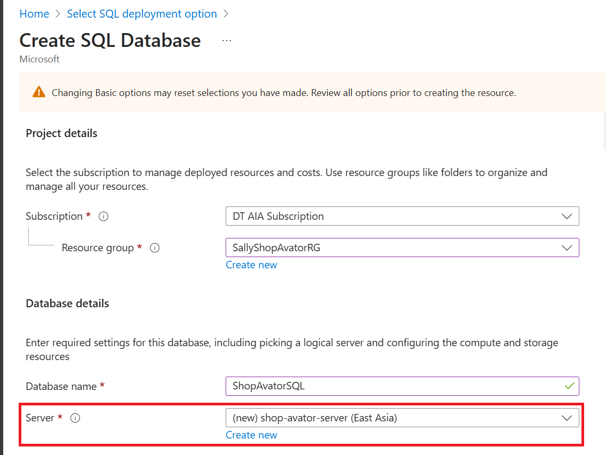 \
      \
     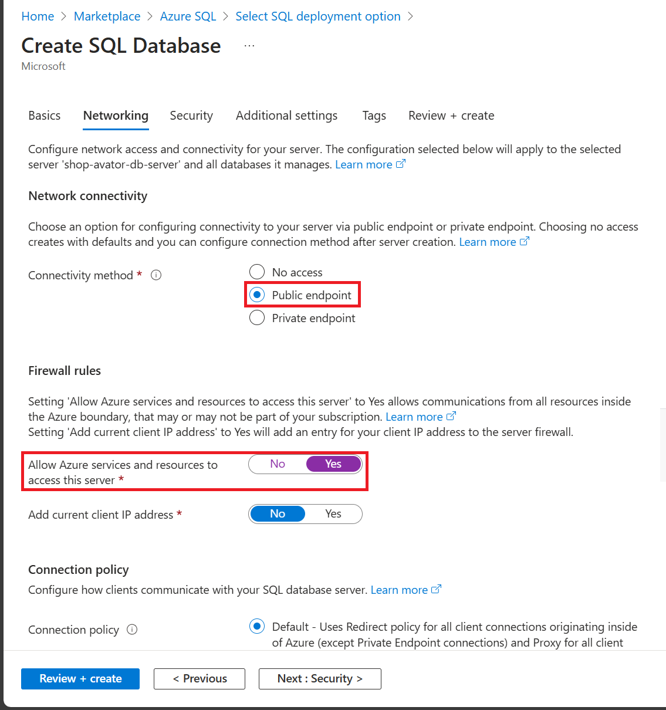
     
   - Azure Speech Services
     - Only available in the following regions: West US 2, West Europe, Southeast Asia, South Central US, Sweden Central, North Europe
      - Plan must be S0
   - Azure AI services multi-service account
   - Azure Blob Storage account
   - Bing Search service

3. Upload the images in the `product-images` directory to a blob container in the Storage Account. Generate a **SAS URL** for the blob storage container. Set the expiry date according to the planned lifecycle of your application. 

    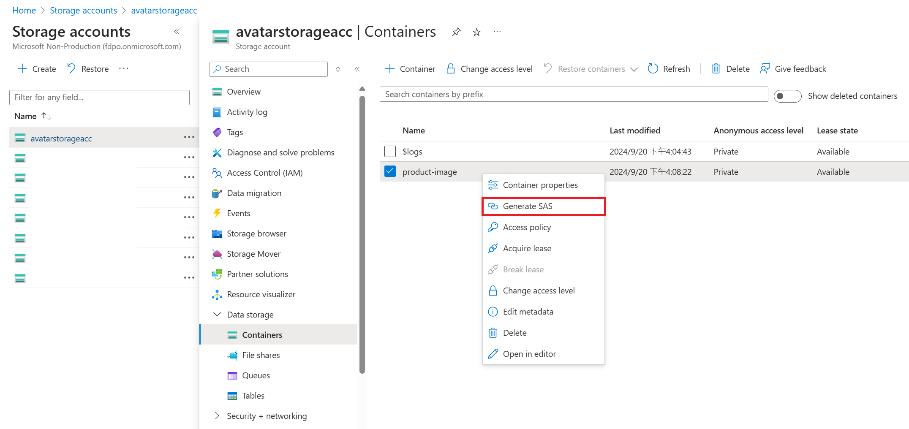 \
    

4. Create a file named `local.settings.json` in the `api` directory of the repository. Make sure to add the following variables to `local.settings.json`. The `AzureWebJobsStorage` variable can be left empty for development purposes.
    ```
    {
      "IsEncrypted": false,
      "Values": {
        "AzureWebJobsStorage": "",
        "FUNCTIONS_WORKER_RUNTIME": "python",
        "AZURE_OPENAI_ENDPOINT": "https://XXX.openai.azure.com/",
        "AZURE_OPENAI_API_KEY": "XXX",
        "AZURE_OPENAI_CHAT_DEPLOYMENT" : "XXX",
        "AZURE_OPENAI_EMBEDDINGS_DEPLOYMENT" : "text-embedding-ada-002",
        "AZURE_OPENAI_API_VERSION" : "XXX",
        "AZURE_SEARCH_ENDPOINT": "https://XXX.search.windows.net",
        "AZURE_SEARCH_API_KEY": "XXX",
        "AZURE_SEARCH_INDEX": "products",
        "AZURE_SPEECH_REGION": "XXX",
        "AZURE_SPEECH_API_KEY": "XXX",
        "TEXT_ANALYTICS_ENDPOINT": "XXX",
        "TEXT_ANALYTICS_KEY": "XXX",
        "BLOB_SAS_URL": "https://XXX",
        "SQL_DB_SERVER": "XXX.database.windows.net",
        "SQL_DB_USER": "XXX",
        "SQL_DB_PASSWORD": "XXX",
        "SQL_DB_NAME": "XXX",
        "BING_KEY": "XXX",
        "BING_SEARCH_URL": "XXX"
      }
    }
    ```
   - For `AzureWebJobsStorage`, pleave leave empty.

   - For `AZURE_OPENAI_ENDPOINT`, `AZURE_OPENAI_API_KEY`, `AZURE_OPENAI_CHAT_DEPLOYMENT`, `AZURE_OPENAI_API_VERSION`, the reference is as below: \
      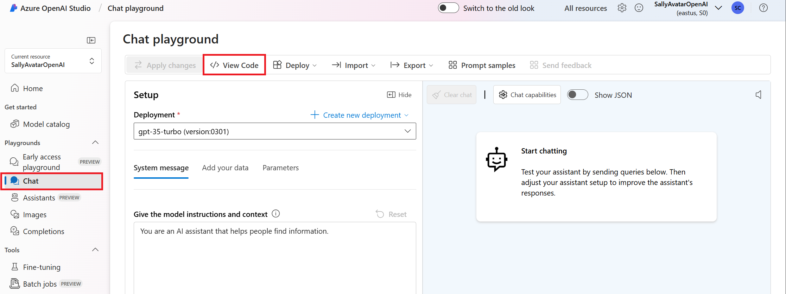 \
      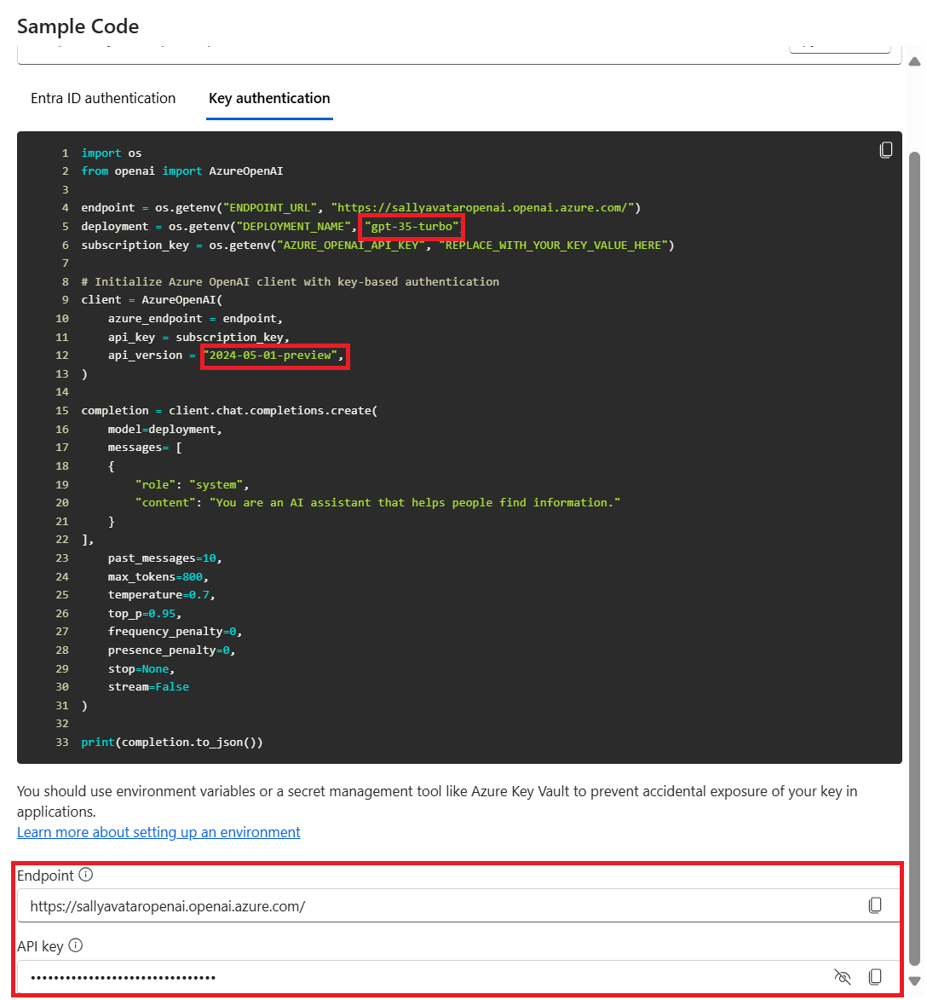

   - For `AZURE_SEARCH_ENDPOINT`, `AZURE_SEARCH_API_KEY`, the reference is as below: \
      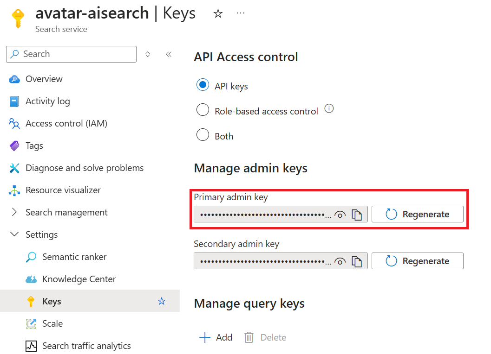 \
      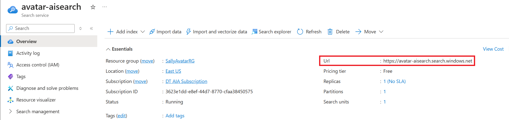

   - For `AZURE_SPEECH_REGION`, `AZURE_SPEECH_API_KEY`, the reference is as below: \
      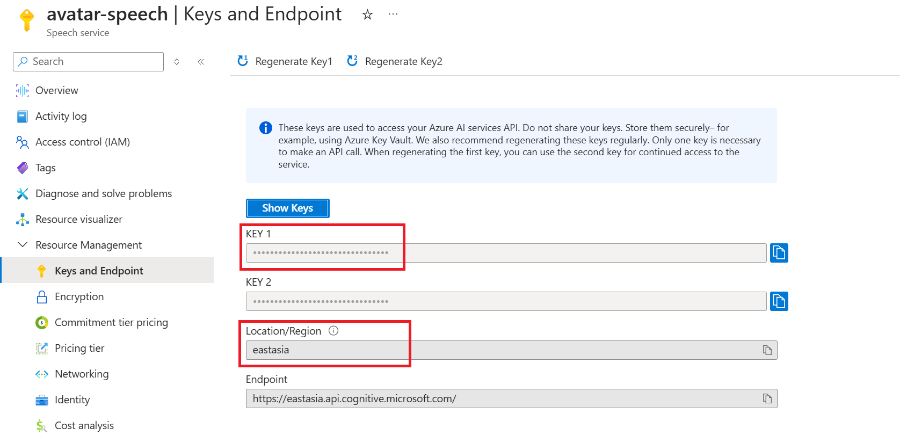

   - For `TEXT_ANALYTICS_ENDPOINT` and `TEXT_ANALYTICS_KEY`, the reference is as below: \
      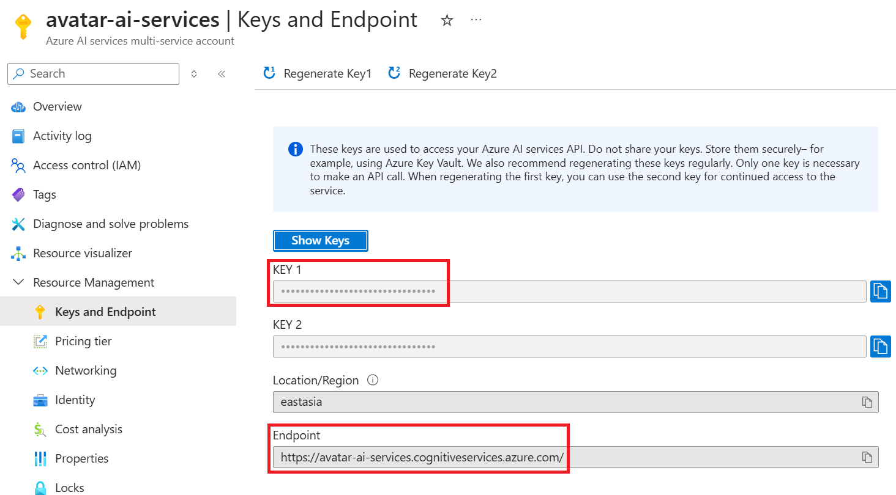

   - For `BLOB_SAS_URL`, the reference is as below: \
      

   - For `SQL_DB_SERVER`, `SQL_DB_USER`, and `SQL_DB_NAME`, the reference is as below: \
      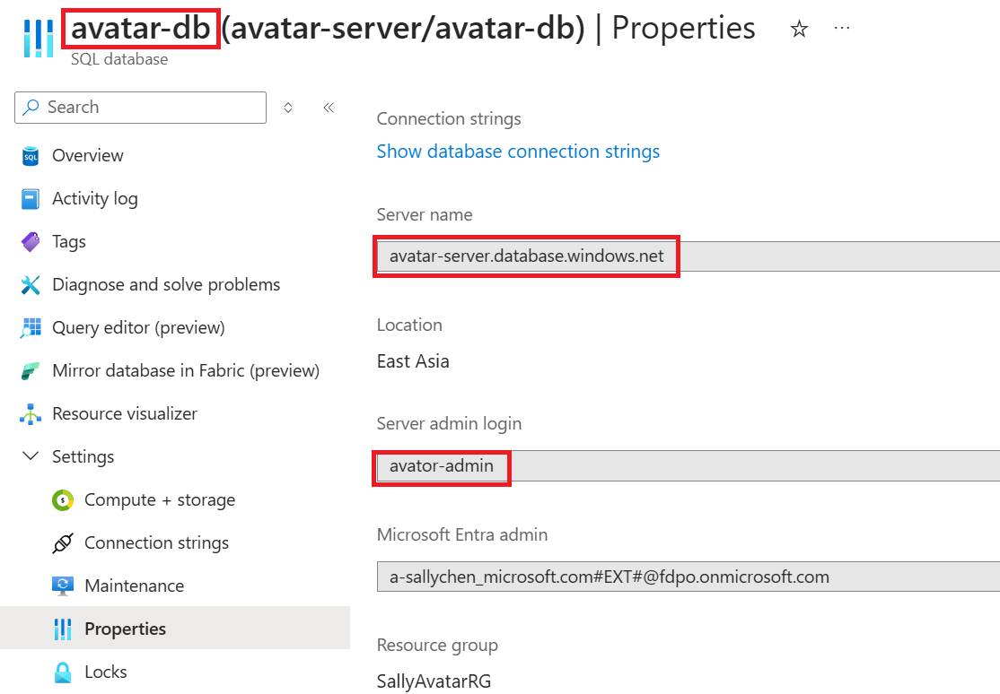

   - For `BING_KEY` and `BING_SEARCH_URL`, the reference is as below: \
      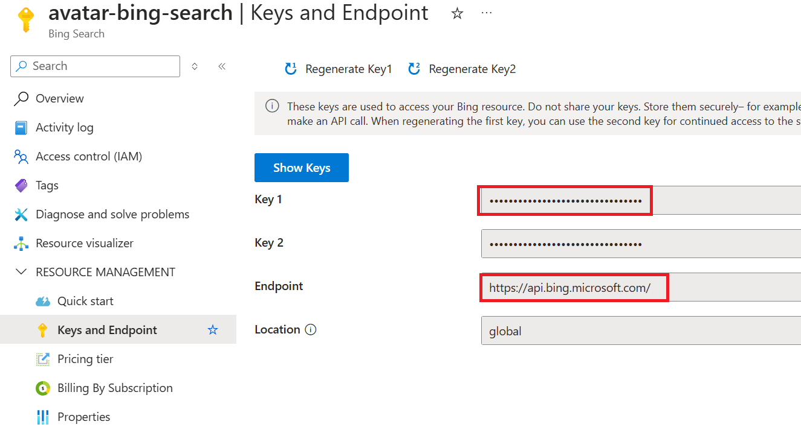

5. Run the cells in the `create-index-and-database.ipynb` notebook to upload the product data to Azure AI Search and the Azure SQL Database.
   - When you are testing connection to the SQL Server, if you receive error message saying that *Azure Active Directory only authentication is enabled. Please contact your system administrator*, please follow the instrucion below: \
      

   - When you are testing connection to the SQL Server, if you receive error message saying that *Cannot open server 'YOUR_SERVER' requested by the login. Client with IP address 'YOUR_IP_ADDRESS' is not allowed to access the server*, please follow the instrucion below: \
      

6. In case you are using an Azure Speech Services instance in a region different from `westeurope`, update line 17 of `main.js` in the `src/js` folder to reflect that. \
    

7. This application can be deployed using Azure Static Web Apps. Refer to this [quickstart](https://docs.microsoft.com/azure/static-web-apps/getting-started?tabs=vanilla-javascript) to learn more. This application is using no front-end frameworks.

    If you are using **Visual Studio Code**, you can execute the following steps:
    - Install the Azure Static Web Apps and Azure Functions extensions
    - Open Azure extension, select your subscription, and right-click on Static Web Apps extension folder, select **Create Static Web App ... (Advanced)** \
        
    - Create Static Web App with the following parameters:  

      | Parameter                 | Description                                                      |
      |---------------------------|------------------------------------------------------------------|
      | Resource group            | Select an existing resource group or create a new one            |
      | Name                      | Choose a name, e.g., avatar-app                                  |
      | Pricing option            | Standard                                                         |
      | Region                    | Select the same or a nearby region as for the above resources    |
      | Framework                 | Custom                                                           |
      | Application code location | avatar/interactive/src                                           |
      | Build output location     | (Leave blank)                                                    |      
    
      It will create an workflow to deploy from GitHub Action to Static Web App without config yet. Here is my sample workflow config for your reference:

      ```
      name: Azure Static Web Apps CI/CD

      on:
        push:
          branches:
            - main
        pull_request:
          types: [opened, synchronize, reopened, closed]
          branches:
            - main

      jobs:
        build_and_deploy_job:
          if: github.event_name == 'push' || (github.event_name == 'pull_request' && github.event.action != 'closed')
          runs-on: ubuntu-latest
          name: Build and Deploy Job
          steps:
            - uses: actions/checkout@v3
              with:
                submodules: true
                lfs: false
            - name: Build And Deploy
              id: builddeploy
              uses: Azure/static-web-apps-deploy@v1
              with:
                azure_static_web_apps_api_token: ${{ secrets.AZURE_STATIC_WEB_APPS_API_TOKEN_CALM_ISLAND_0683BD41E }}
                repo_token: ${{ secrets.GITHUB_TOKEN }} # Used for Github integrations (i.e. PR comments)
                action: "upload"
                ###### Repository/Build Configurations - These values can be configured to match your app requirements. ######
                # For more information regarding Static Web App workflow configurations, please visit: https://aka.ms/swaworkflowconfig
                app_location: "/avatar/interactive/src" # App source code path
                api_location: "/avatar/interactive/api" # Api source code path - optional
                output_location: "" # Built app content directory - optional
                ###### End of Repository/Build Configurations ######

        close_pull_request_job:
          if: github.event_name == 'pull_request' && github.event.action == 'closed'
          runs-on: ubuntu-latest
          name: Close Pull Request Job
          steps:
            - name: Close Pull Request
              id: closepullrequest
              uses: Azure/static-web-apps-deploy@v1
              with:
                azure_static_web_apps_api_token: ${{ secrets.AZURE_STATIC_WEB_APPS_API_TOKEN_CALM_ISLAND_0683BD41E }}
                action: "close"
      ```

8. In the VSCode Static Web Apps extension, navigate to **Application Settings** of your app and right-click **Upload Local Settings**. This will populate the settings from `local.settings.json` to the web app. You can verify if the environment variables are correct via Azure portal.\
    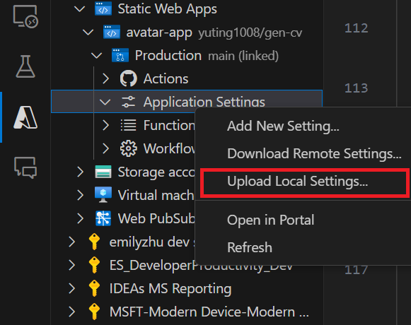 \
    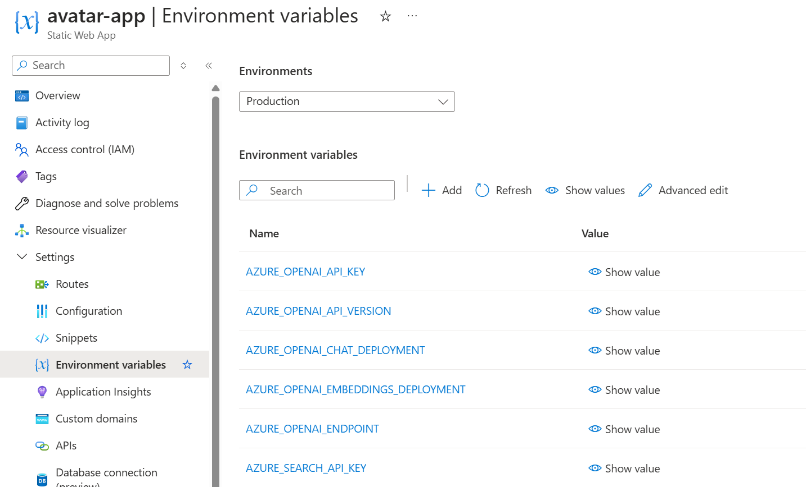

9. In the VSCode Static Web Apps extension, right-click on your app name and select **Browse site** to use the app. \
    

## Notes on running the solution locally

- ODBC Driver 17 for SQL Server is required to run the solution locally.
   - You can install it via this [link](https://learn.microsoft.com/zh-tw/sql/connect/odbc/download-odbc-driver-for-sql-server?).
- The solution has been tested with Node version 18.0.0.
- To run the solution locally, please follow the instructions below:
  - We use Use the Static Web Apps CLI to run the solution. You can install it via npm. Details can be found [here](https://azure.github.io/static-web-apps-cli/docs/use/install/).
      ```
      npm install -g @azure/static-web-apps-cli
      swa --version
      ```
  - Create your Python environment and install the necessary dependencies. For our development, we utilized Conda and the running environment is Python 3.11. You can do the same with these commands:
      ```bash
      conda create -n avatar python=3.11
      conda activate avatar
      pip install -r avatar\interactive\api\requirements.txt
      ```
  - After navigating in the terminal to `avatar/interactive`, the following command can be used to run the solution. Once succeed, you will see the output on console.
        ```bash
        swa start src --api-location api
        ``` \
        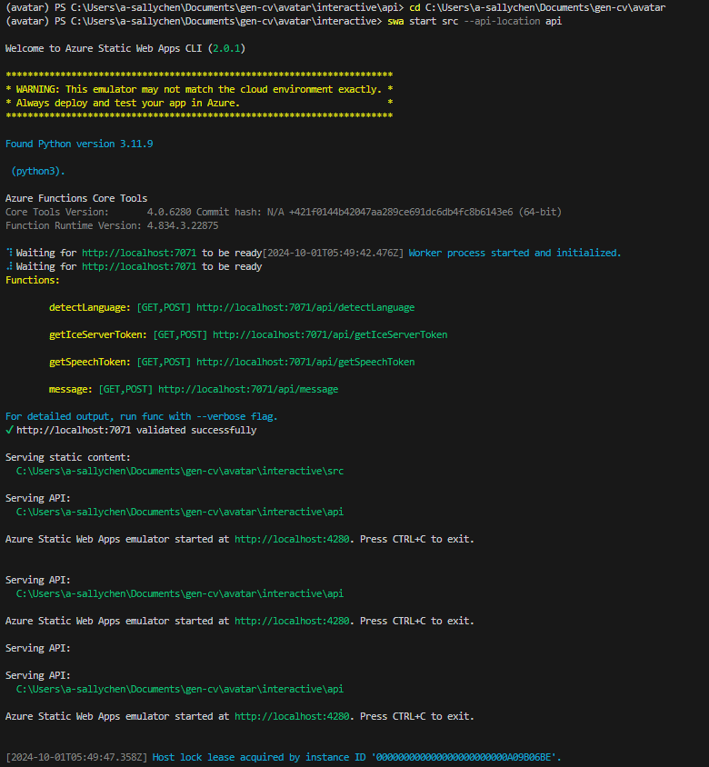


## Hints on debugging

- The login screen is currently non-functional. You can click on 'login' without entering any information and you will be redirected to the main page.
- If the avatar is not loading on the main page, refresh the web page with the console open. This will show the error message.
- When you see an error message saying *Failed to load resource: the server responded with a status of 404 (/favicon.ico:1)*, you may try cleaning your cache to fix this issue.
- You can open console to further deal with your bugs. \
  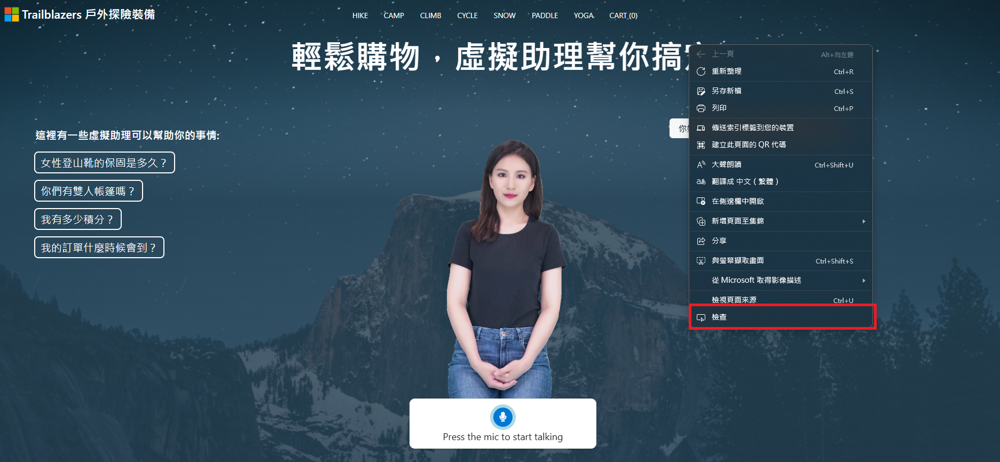 \
  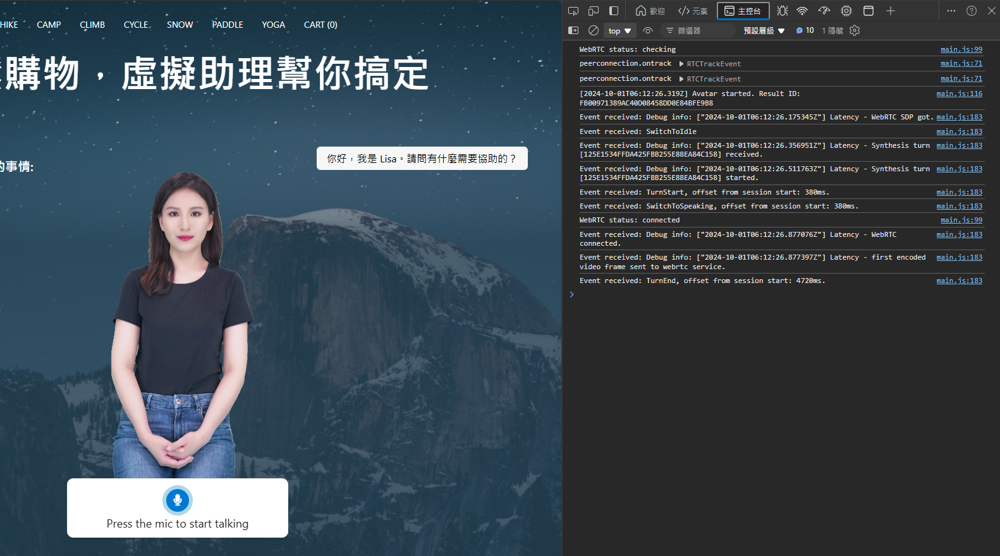
